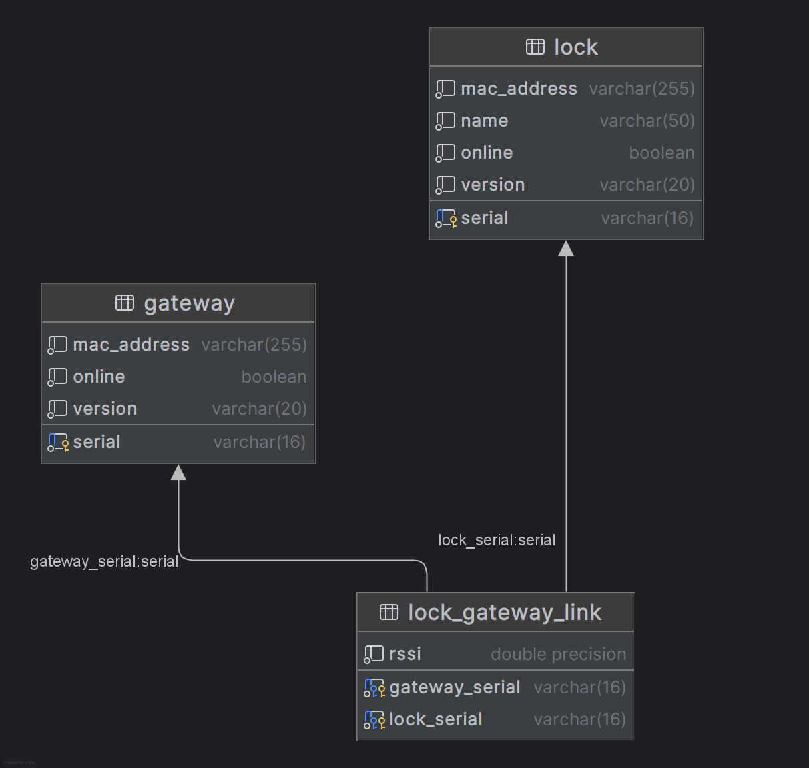

# Initial Project Evaluation

This project is a challenge that simulates the implementation of access control for locks and gateways in an IoT system.

It was developed as a REST API, allowing retrieval and editing of information related to locks, entry doors, and access links.

---

## Technologies

The challenge was developed using Java (minimum version 21, version 24 is also acceptable), Spring Boot (version 3.4.6), and managed via Gradle Kotlin DSL.

## Persistence and Database

PostgreSQL (latest version) was used inside a Docker container via Docker Compose.

A persistence layer was also implemented using JPA (Spring Data). The persistence classes are located in the following packages:

* **Repositories**: `com.vingcard.athos.interview.persistence.repository`
* **Entities**: `com.vingcard.athos.interview.persistence.entity`

An auxiliary class called `DummyDataLoader` was also implemented, which populates the system with dummy data. This class is located in the package `com.vingcard.athos.interview.persistence`.

> These dummy records are loaded during application startup when the `dummydata` profile is active.

Below is the diagram extracted from the database:

  
<small>Extracted using JetBrains DataGrip IDE.</small>

## Controller Layer

Three controller classes were implemented, following level 2 of the REST Maturity Model. All are located in the package `com.vingcard.athos.interview.controller`.

A global `@ControllerAdvice` was also added within the same controller package.

# Configuration

The project includes basic configuration for `CORS` and for `Resource Handlers`.

---

# Strengths

* Easy setup of the development environment due to PostgreSQL setup via Docker Compose.
* Automated tests implemented in nearly all application layers.

# Areas for Improvement

* Service layer is missing.
* Exception handling does not follow a consistent response pattern and is placed in the same package as controllers.
* PostgreSQL configuration in Docker Compose does not follow best practices.
* DTO classes are missing.
* All `@RequestMapping` annotations in controllers repeat the `/api` prefix and do not include any versioning indication.
